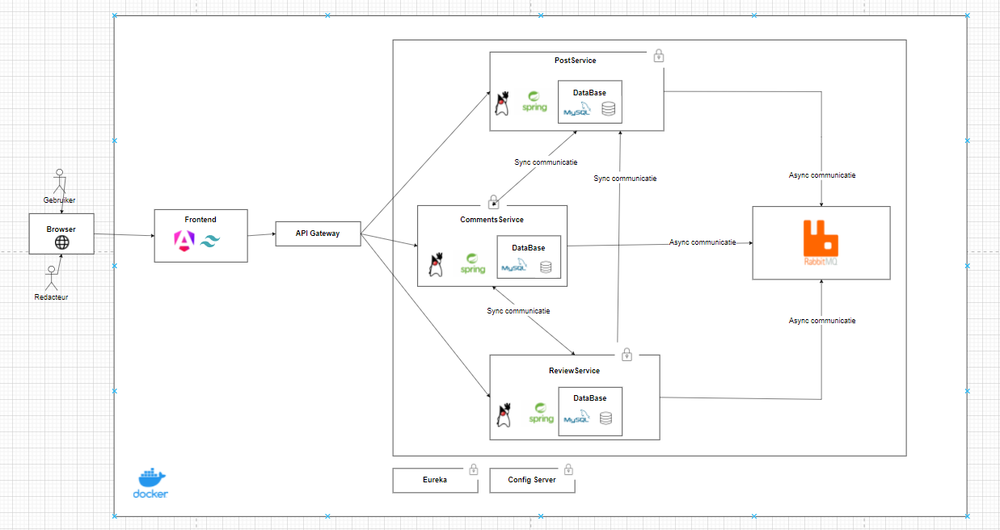

# Architecture

## Browser

Gebruiker en Redacteur kunnen toegang krijgen tot de applicatie via de Browser.

## Front-end

Gebruikers en redacteurs kunnen interactie hebben met de applicatie

## API Gateway

Beheert de communicatie tussen de front-end en de backend services. Het is een toegangspunt voor alle aanvragen die naar de backend services worden gestuurd.

## PostService

- Redacteurs kunnen posts aanmaken, opslaan als concept, bewerken en publiceren. (US1,2,3)
- Gebruiker kan een overzicht van gepubliceerde posts zien. (US4)
- Posts filteren (US5)
- Postgegevens worden opgeslagen in MySQL database en communiceert met ReviewService op een synchrone manier. PostService maakt gebruik van synchrone communicatie met ReviewService om de reviews op te halen en te verwijderen.
- Haalt meldingen op van RabbitMQ (bijv. goedkeuring, afwijzing, review reactie). (asynchroon)
- Gebruikt Notificatio-Service voor notificaties, bijvoorbeeld als er een nieuwe reactie wordt geplaatst. Ontvangt men een email.

## ReviewService

- Redacteurs kunnen posts bekijken, goedkeuren of afwijzen. (US7)
- Wanneer een post wordt goedgekeurd of afgewezen, stuurt de ReviewService een melding naar RabbitMQ om de redacteur op de hoogte te brengen (asynchrone). (US8)
- Redacteurs kunnen opmerkingen toevoegen bij afwijzing van een post. Het wordt naar RabbitMQ verstuurd en het wordt later opgehaald door PostService. (asynchroon) (US9)

## CommentService

- Gebruikers kunnen een reactie plaatsen en reacties van andere collega’s lezen. (US10,11)
- Gebruikers kunnen hun eigen reacties bewerken of verwijderen. (US12)
- Communiceert met de PostService voor informatie over posts en gebruikt een eigen MySQL database voor het opslaan van reacties. (synchroon)

## Notification-Service

- Verwertk de email proces

## Eureka

Wordt gebruikt als een service registry waar alle microservices zich registreren, zodat ze elkaar kunnen vinden en met elkaar kunnen communiceren.

## Config Server

Beheert de configuraties van alle services op een centrale plek. Het is handig voor het beheren van configuratiewijzigingen.
